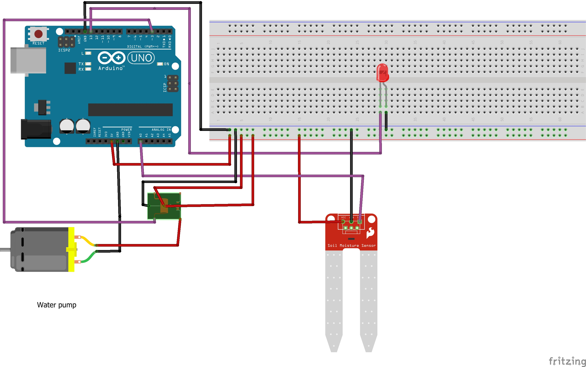

An automation project using Arduino to water house plants.

*IN PROGRESS*

## Build steps

Here

## Components

*NOTE: Many of these components were procured in China, they may not be easily available in other countries.*

- Arduino board: UNO
- Moisture sensor:
- Relay:
- Water pump: Solar

# Wiring

# Libraries

All libraries are included in the lib dir in the project.

Using the following:

- [elapsedMillis](https://github.com/pfeerick/elapsedMillis
